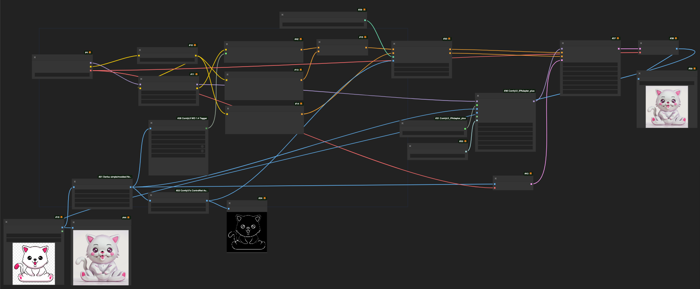

#What do you need to run this workflow?



# Models

Model: ReV Animated v1.2.2-EOL -  (folder: /ComfyUI/models/checkpoints)

https://civitai.com/api/download/models/46846

LoRA: 3DMM_V12 - (folder: /ComfyUI/models/loras)

https://civitai.com/api/download/models/107366

Control Net: (folder: /ComfyUI/models/controlnet)

https://huggingface.co/lllyasviel/control_v11p_sd15_scribble/tree/main

IP Adapter: ip-adapter-plus_sd15.bin - (folder: /ComfyUI/models/ipadapter)

https://huggingface.co/h94/IP-Adapter

You will find 2 models
- https://huggingface.co/h94/IP-Adapter/tree/main/models (models)
- https://huggingface.co/h94/IP-Adapter/tree/main/models/image_encoder  (decoders)

To download them you can use this trick
```bash
wget --content-disposition 'https://huggingface.co/h94/IP-Adapter/resolve/main/models/ip-adapter-plus_sd15.safetensors?download=true'
```
